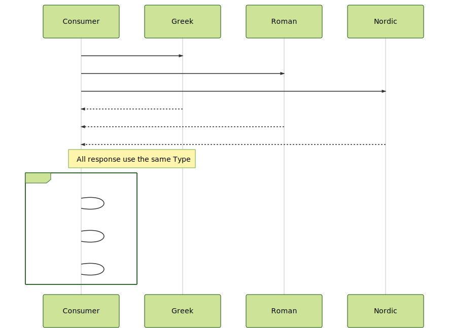
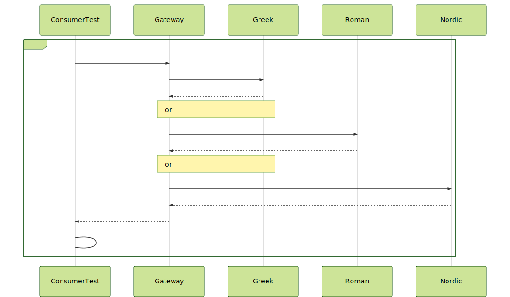
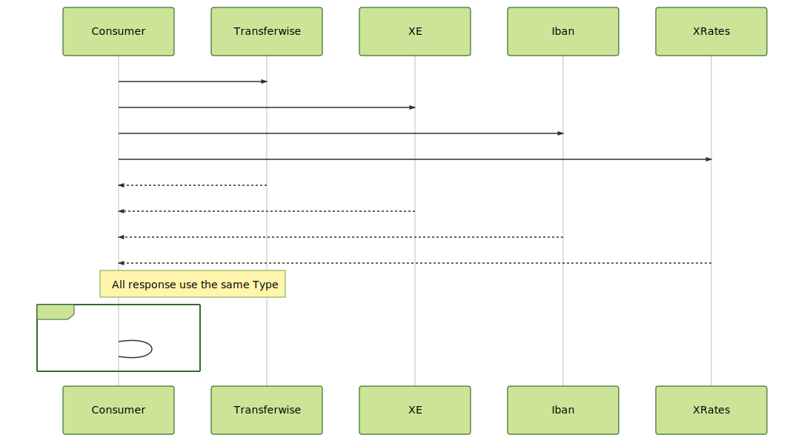
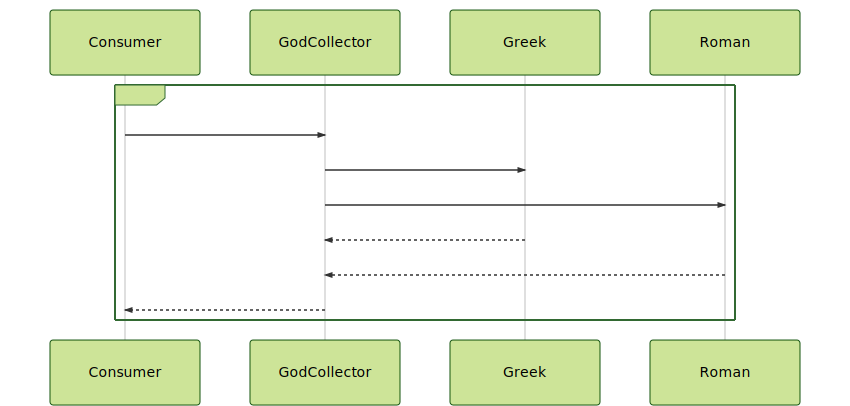

# Latency problems

## Motivation

[Euler problems](https://projecteuler.net/archives) are an excellent source of Mathematical
problems to improve your programming skills. The problems are able to be solved with multiple 
programming paradigms like Object Oriented, Functional or Reactive.

But in the implementation process, I missed that the problems don´t add any Latency factor to
increase the complexity and this is part of the daily problems for every Software Engineer in the market.

Programming languages provide native solutions to manage latency.
In `Java`, you can use [CompletableFuture](https://docs.oracle.com/javase/8/docs/api/java/util/concurrent/CompletableFuture.html), 
in `Kotlin` you can use [Coroutines](https://kotlinlang.org/docs/reference/coroutines-overview.html), 
in `Scala` you can use [Future](https://www.scala-lang.org/api/2.12.3/scala/concurrent/Future.html),
in `Clojure` you can use [Future](https://clojuredocs.org/clojure.core/future).

On top of the languages, exist libraries that improve the way to manage [asynchronous](https://www.reactivemanifesto.org/glossary#Asynchronous) calls 
and add [Backpressure](https://www.reactivemanifesto.org/glossary#Back-Pressure) support for Reactive use cases. In `Reactor` you can use [Mono<T>](https://projectreactor.io/docs/core/release/api/reactor/core/publisher/Mono.html) or 
[Flux<T>](https://projectreactor.io/docs/core/release/api/reactor/core/publisher/Flux.html) objects,
in `RxJava`, you can use [Flowable<T>](http://reactivex.io/RxJava/2.x/javadoc/io/reactivex/Flowable.html) 

Finally, exist libraries that offer rich implementations of Reactive programming patterns.
In `Resilience4j`, you could find solutions for: `Circuit breaking`, `Rate limiting`, `Bulkheading`, `Automatic retrying`

The purpose of this repository is the creation of a set problems adding the Latency as part of the problem to be solved
in many different ways.

Enjoy the journey!

Juan Antonio Breña Moral

## Problems

### Problem 1

``` gherkin 
Feature: Consume some REST God Services

Background: Decimal representation of Zeus: `Zeus` = 122101117115

Scenario: Consume the API in a Happy path case
    Given a list of REST API about Greek, Roman & Nordic
    When  call and retrieve all API info from the good list
    Then  filter by god starting with `n`
    And   convert the names into a decimal format
    And   sum

Scenario: Consume API but greek service is slow
    Given a list of REST API about Greek, Roman & Nordic
    When  call and retrieve all API info from the good list
    Then  filter by god starting with `n`
    And   convert the names into a decimal format
    And   sum

```



**Notes:** 

- Review the timeout for Every connection.
- If in the process to load the list, the timeout is reached, the process will calculate with the rest of
the lists.
- REST API: https://my-json-server.typicode.com/jabrena/latency-problems


### Problem 2

Greek gods are quite popular and they have presence in Wikipedia, the multilingual online encyclopedia.
If you try to find further information about `Zeus` you should visit the address: https://en.wikipedia.org/wiki/Zeus

Load the list of Greek Gods and discover what is the God with more literature described on Wikipedia.


**Notes:** 

- Review the timeout for Every connection.
- REST API 1: https://my-json-server.typicode.com/jabrena/latency-problems/greek
- REST API 2: https://en.wikipedia.org/wiki/{greekGod}

### Problem 3


God fans are using a new API to provide information about `GREEK`, `ROMAN` or `NORDIC` gods.
It is important that the interface support Concurrent access to the API. Provide a Test that ensure
that in a Concurrent scenario, the information retrieved is `Thread Safe`.




**Notes:** 

- Review the timeout for Every connection.
- REST API 1: https://my-json-server.typicode.com/jabrena/latency-problems/greek


### Problem 4

``` gherkin
Given a set of providers to exchange money 
When  make the request to get the rate for the exchange 100 EUR into USD
Then  find the average rate from valid responses from the the providers
```



**Notes:** 
Review the timeout for Every connection.
Money exchange providers:
- https://transferwise.com/fr?sourceCurrency=EUR&targetCurrency=USD&sourceAmount=100
- https://www.xe.com/es/currencyconverter/convert/?Amount=100&From=EUR&To=USD
- https://www.iban.com/currency-converter?from_currency=EUR&to_currency=USD&amount=100
- https://www.x-rates.com/calculator/?from=EUR&to=USD&amount=100


### Problem 5

``` gherkin
Feature: Load Balancing

Scenario: Consume a REST Greek God Service
    Given a 5 instances of the same REST API about Greek gods
    When  the client sends the request
    And   execute a load balancing policy to distribute the traffic
    Then  return all gods starting with `a`
```


**Notes:** 

- Try to test the solution without any Internet call
- Review the timeout for Every connection.
- Review the load balancing options
- REST API 1: https://my-json-server.typicode.com/jabrena/latency-problems/greek

### Problem 6

``` gherkin
Feature: Consume a REST Greek God Service

Scenario: Consume the API in a Happy path case
    Given a REST API about Greek gods
    When  the client sends the request
    And   execute a Retry Policy
    Then  return all gods starting with `a`

Scenario: Force an internal Retry behaviour
    Given a REST API about Greek gods
    When  the client sends the request
    And   execute a Retry Policy
    Then  return all gods starting with `a`

Scenario: Consume the API with a bad response
    Given a REST API about Greek gods
    When  the client sends the request
    And   execute a Retry Policy
    Then  return all gods starting with `a`

Scenario: Consume the API with a corrupted response
    Given a REST API about Greek gods
    When  the client sends the request
    And   execute a Retry Policy
    Then  return all gods starting with `a`

Scenario: Test a bad internal configuration
    Given a REST API about Greek gods
    When  the client sends the request
    And   execute a Retry Policy
    Then  return all gods starting with `a`

```


**Notes:** 

- Try to test the solution without any Internet call
- Review the timeout for Every connection.
- Review the retry options
- REST API 1: https://my-json-server.typicode.com/jabrena/latency-problems/greek


### Problem 7

``` gherkin
Feature: Consume a REST Roman God Service

Scenario: Consume the API in a Happy path case
    Given a REST API about Roman gods
    When  the client sends the request
    And   execute a Circuit Breaker Policy
    Then  return all gods finishing the name with `s`

Scenario: Force an internal Circuit Breaker behaviour
    Given a REST API about Roman gods
    When  the client sends the request
    And   execute a Circuit Breaker Policy
    Then  return all gods finishing the name with `s`

```


**Notes:** 

- Try to test the solution without any Internet call
- Review the timeout for Every connection.
- Review the circuit breaker options
- REST API 1: https://my-json-server.typicode.com/jabrena/latency-problems/roman

### Problem 8

``` gherkin
Feature: Consume a REST Indian God Service

Background:
A new REST API was deployed recently and the service 
doesn´t have the same capacity than other God Services.
It is necessary to protect the service with a rate limiter temporally
meanwhile the God Infrastructure is increasing the consumer capacity.

Scenario: Consume the API in a Happy path case
    Given a REST API about Indian gods
    When  the client sends the request
    And   execute a Rate limiter Policy
    Then  return all gods who contains in the name `a` & `i`

Scenario: Force a Rate limiter behaviour
    Given a REST API about Indian gods
    When  the client sends the request
    And   execute a Rate limiter Policy
    Then  return all gods who contains in the name `a` & `i`

```


**Notes:** 

- Try to test the solution without any Internet call
- Review the timeout for Every connection.
- Review the rate limiter options
- REST API 1: https://my-json-server.typicode.com/jabrena/latency-problems/indian

### Problem 9

``` gherkin
Feature: Consume a REST God Collector

Background:
The new REST God collector service has a high demand
and it is necessary to protect the internal subsystems from
high levels of concurrent traffic. 

Scenario: Consume the API in a Happy path case
    Given a REST API about God collector
    When  the client sends the request
    And   execute a Bulkhead Policy
    Then  return all gods

Scenario: Force a Bulkhead behaviour
    Given a REST API about God collector
    When  the client sends the request
    And   execute a Bulkhead Policy
    Then  return all gods
```




**Notes:** 

- Try to test the solution without any Internet call
- Review the timeout for Every connection.
- Review the bulkhead options
- REST API 1: https://my-json-server.typicode.com/jabrena/latency-problems/greek
- REST API 2: https://my-json-server.typicode.com/jabrena/latency-problems/roman


## [Troubleshooting](./TROUBLESHOOTING.md)

## [References](./REFERENCES.md)

