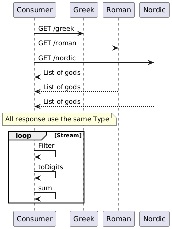

# Problem 1

## User Story Statement

- **As an** API consumer / data analyst
- **I want to** consume God APIs (Greek, Roman & Nordic), filter gods whose names start with 'n', convert each filtered god name into a decimal representation, and return the sum of those values
- **So that** I can perform cross-pantheon analysis and aggregate mythology data for research, reporting, or educational applications.

**Notes:**

- Decimal conversion: Each character in a god name is converted to its numeric code (e.g., ASCII/Unicode), and those values are summed per name. The final result is the sum of all such per-name sums.
- Case sensitivity: Filtering uses case-insensitive matching (e.g., "Nike", "Nemesis", "Njord").
- APIs: Assumes REST APIs similar to [my-json-server-oas.yaml](./my-json-server-oas.yaml).

## Gherkin file

```gherkin
Feature: Consume some REST God Services
# Notes:
# - Decimal Conversion Rule: Name then each char to its Unicode int value, then concatenate these ints as strings.
# (e.g., "Zeus" -> Z(90)e(101)u(117)s(115) -> "90101117115").
# - If in the process to load the list, the timeout is reached, the process will calculate with the rest of the lists.
# - Filtering for gods starting with 'n' is case-sensitive (only lowercase 'n').
# - Greek API: https://my-json-server.typicode.com/jabrena/latency-problems/greek
# - Roman API: https://my-json-server.typicode.com/jabrena/latency-problems/roman
# - Nordic API: https://my-json-server.typicode.com/jabrena/latency-problems/nordic

Background:
    Given the system is configured to use the Greek, Roman, and Nordic god name APIs
    And the system is configured with an API call timeout of 5 seconds

Scenario: Consume the APIs in a Happy path scenario
    When  call and retrieve all API info
    Then  filter by god starting with `n`
    And   the filtered god names are converted into a decimal format
    And   the total sum of the decimal values should be 78179288397447443426
```

[Guerkin file](./problem1.feature)

## UML Sequence diagram



## Open API to integrate with the REST API

- [Open API Specification](./my-json-server-oas.yaml)

## Issues detected

- The filter create confussion because exist 2 decisions:
- transform the god name to lowercase only for the filter or transform for everything.

It could be interesting to be added to the gherkin file
