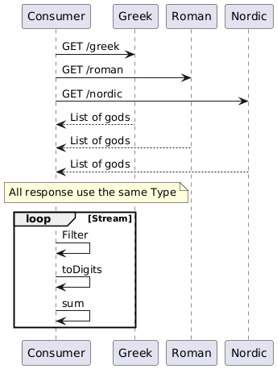

# Problem 1

## Gherkin file

```gherkin
Feature: Consume some REST God Services
# Notes:
# - Decimal Conversion Rule: Name to lowercase, then each char to its Unicode int value, then concatenate these ints as strings. (e.g., "Zeus" -> "zeus" -> z(122)e(101)u(117)s(115) -> "122101117115").
# - If in the process to load the list, the timeout is reached, the process will calculate with the rest of the lists.
# - API failures (timeouts or non-200 HTTP status codes) mean data from that API is not included in calculations.
# - Filtering for gods starting with 'n' is case-sensitive (only lowercase 'n').
# - Greek API: https://my-json-server.typicode.com/jabrena/latency-problems/greek
# - Roman API: https://my-json-server.typicode.com/jabrena/latency-problems/roman
# - Nordic API: https://my-json-server.typicode.com/jabrena/latency-problems/nordic

Background:
    Given the system is configured to use the Greek, Roman, and Nordic god name APIs
    And the system is configured with an API call timeout of 5 seconds

Scenario: Consume the APIs in a Happy path scenario
    When  call and retrieve all API info
    Then  filter by god starting with `n`
    And   the filtered god names are converted into a decimal format
    And   the total sum of the decimal values should be 78179288397447443426

Scenario: Consume APIs and no gods match filter
    When  call and retrieve all API info
    Then  filter by god starting with `n`
    And   the system indicates that no gods matched the filter
    And   the total sum of the decimal values should be 0

Scenario Outline: Consume the APIs when one service is unresponsive
    And the <UnresponsiveAPI> is expected to be unresponsive
    When  the system attempts to call all APIs and uses data from successfully responding services
    Then  the system logs should indicate that the <UnresponsiveAPI> call timed out
    And   filter by god starting with `n`
    And   the filtered god names are converted into a decimal format
    And   the total sum of the decimal values should be <ExpectedSum>

    Examples:
      | UnresponsiveAPI | ExpectedSum        |
      | Greek API       | <sum_if_greek_fails> |
      | Roman API       | <sum_if_roman_fails> |
      | Nordic API      | <sum_if_nordic_fails>|
```

## UML Sequence diagram



## Open API to integrate with the REST API

- [Open API Specification](./my-json-server-oas.yaml)

