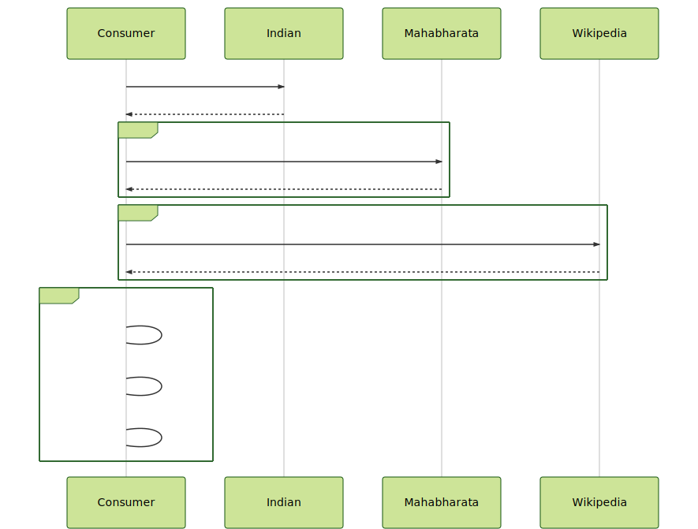

# Problem 10

``` gherkin
Feature: Calculate the popularity of Indian gods in Mahabharata

Background:
The Mahabharata is one of the two major Sanskrit epics of ancient India

Scenario: Calculate the influence of Indian gods in Mahabharata
    Given a REST API about Indian Gods
    When  the client sends the request
    Then  return the Top 3 indian gods mentioned in Mahabharata
    And   with presence in Wikipedia
    And   the number of hits in Mahabharata data source

```




- Try to test the solution without any Internet call
- Review the timeout for Every connection.
- REST API 1: https://my-json-server.typicode.com/jabrena/latency-problems/indian
- Mahabharata Data Source: https://archive.org/stream/TheMahabharataOfKrishna-dwaipayanaVyasa/MahabharataOfVyasa-EnglishTranslationByKMGanguli_djvu.txt
- REST API 2: https://en.wikipedia.org/wiki/{indianGod}
