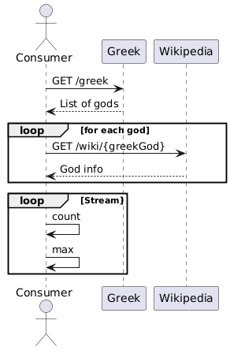

# Problem 2

Greek gods are quite popular and they have presence in Wikipedia, the multilingual online encyclopedia.
If you try to find further information about `Zeus` you should visit the address: https://en.wikipedia.org/wiki/Zeus

Load the list of Greek Gods and discover what is the God with more literature described on Wikipedia.

## Gherkin file

```gherkin
Feature: Greek Gods Wikipedia Information
  As a user
  I want to find out which Greek god has the most literature on Wikipedia
  So that I can learn more about them

  Background:
    Given the following REST APIs:
      | API Name      | URL                                                              |
      | Greek Gods    | https://my-json-server.typicode.com/jabrena/latency-problems/greek |
      | Wikipedia     | https://en.wikipedia.org/wiki/{greekGod}                         |
    And the amount of literature for a god on Wikipedia is defined as the character length of its page content

  Scenario: Successfully retrieve the list of Greek gods
    When I request the list of Greek gods
    Then I should receive a non-empty list of Greek god names

  Scenario: Identify the Greek god with the most literature on Wikipedia
    Given I have the list of Greek gods
    When I retrieve the Wikipedia page for each god
    And I calculate the character length of each god's Wikipedia page content, assuming a length of 0 if a page cannot be retrieved
    Then I should be presented with a list of god name(s) that have the most literature, along with their character count
```

## UML Sequence diagram



## Open API to integrate with the REST API

- [Open API Specification](./my-json-server-oas.yaml)

