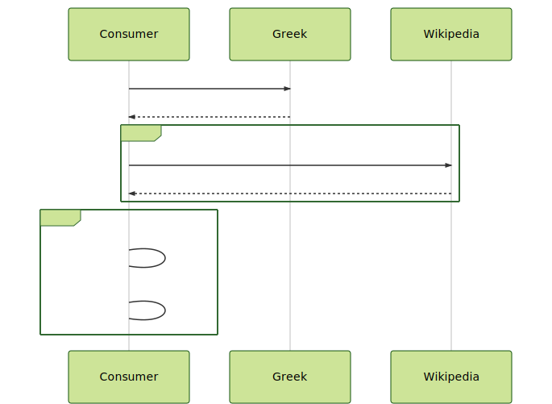

# Sequence diagram for Latency problem 2

- https://mermaidjs.github.io/mermaid-live-editor

## Diagram:

```
sequenceDiagram
    Consumer->>Greek: GET /greek
    Greek-->>Consumer: List of gods
    loop god
        Consumer->>Wikipedia: GET /wiki/{greekGod}
        Wikipedia-->>Consumer: God info
    end
    loop Stream    
        Consumer->Consumer: count
        Consumer->Consumer: max
    end
```

## Visualization:



## Config:

```
{
  "theme": "forest"
}
```
