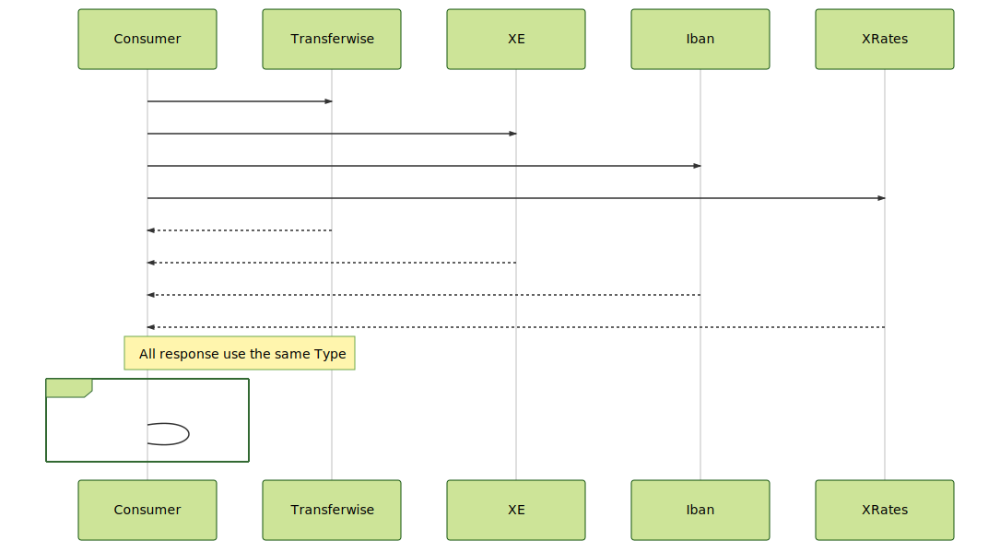

### Problem 4

```gherkin
Given a set of providers to exchange money
When  make the request to get the rate for the exchange 100 EUR into USD
Then  find the average rate from valid responses from the the providers
```



**Notes:**
Review the timeout for Every connection.
Money exchange providers:
- https://transferwise.com/fr?sourceCurrency=EUR&targetCurrency=USD&sourceAmount=100
- https://www.xe.com/es/currencyconverter/convert/?Amount=100&From=EUR&To=USD
- https://www.iban.com/currency-converter?from_currency=EUR&to_currency=USD&amount=100
- https://www.x-rates.com/calculator/?from=EUR&to=USD&amount=100

