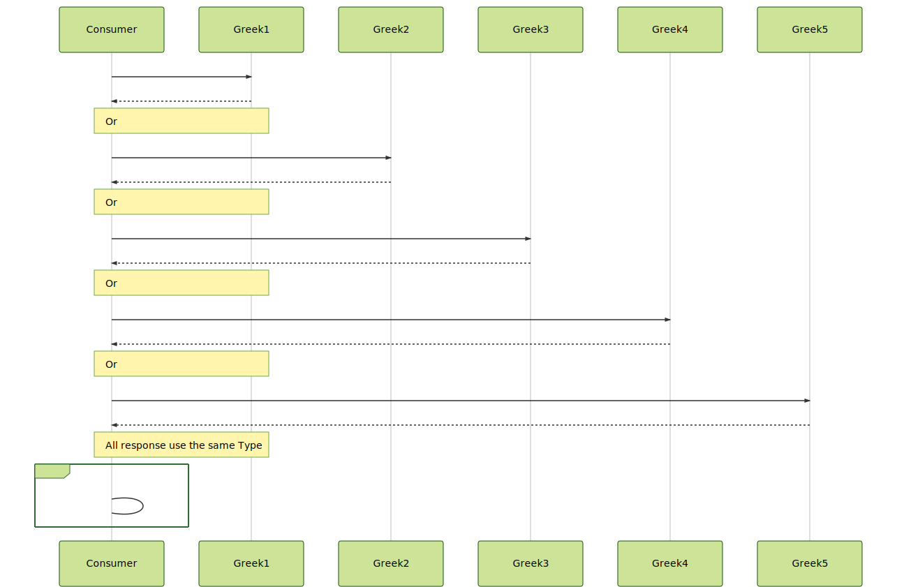

# Problem 5

```gherkin
Feature: Load Balancing

Scenario: Consume a REST Greek God Service
    Given a 5 instances of the same REST API about Greek gods
    When  the client sends the request
    And   execute a load balancing policy to distribute the traffic
    Then  return all gods starting with `a`
```



**Notes:**

- Try to test the solution without any Internet call
- Review the timeout for Every connection.
- Review the load balancing options
- REST API 1: https://my-json-server.typicode.com/jabrena/latency-problems/greek
