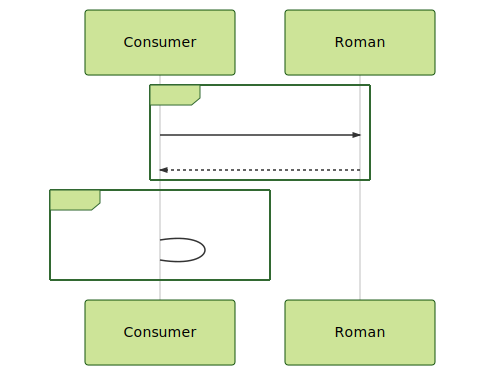

# Problem 7

```gherkin
Feature: Consume a REST Roman God Service

Scenario: Consume the API in a Happy path case
    Given a REST API about Roman gods
    When  the client sends the request
    And   execute a Circuit Breaker Policy
    Then  return all gods finishing the name with `s`

Scenario: Force an internal Circuit Breaker behaviour
    Given a REST API about Roman gods
    When  the client sends the request
    And   execute a Circuit Breaker Policy
    Then  return all gods finishing the name with `s`

```



**Notes:**

- Try to test the solution without any Internet call
- Review the timeout for Every connection.
- Review the circuit breaker options
- REST API 1: https://my-json-server.typicode.com/jabrena/latency-problems/roman
