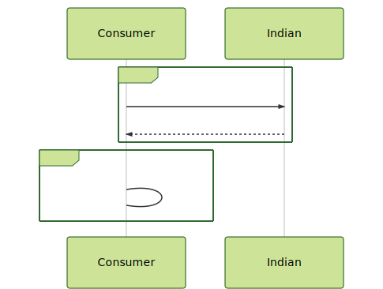

# Problem 8

```gherkin
Feature: Consume a REST Indian God Service

Background:
A new REST API was deployed recently and the service
doesn´t have the same capacity than other God Services.
It is necessary to protect the service with a rate limiter temporally
meanwhile the God Infrastructure is increasing the consumer capacity.

Scenario: Consume the API in a Happy path case
    Given a REST API about Indian gods
    When  the client sends the request
    And   execute a Rate limiter Policy
    Then  return all gods who contains in the name `a` & `i`

Scenario: Force a Rate limiter behaviour
    Given a REST API about Indian gods
    When  the client sends the request
    And   execute a Rate limiter Policy
    Then  return all gods who contains in the name `a` & `i`

```



**Notes:**

- Try to test the solution without any Internet call
- Review the timeout for Every connection.
- Review the rate limiter options
- REST API 1: https://my-json-server.typicode.com/jabrena/latency-problems/indian
