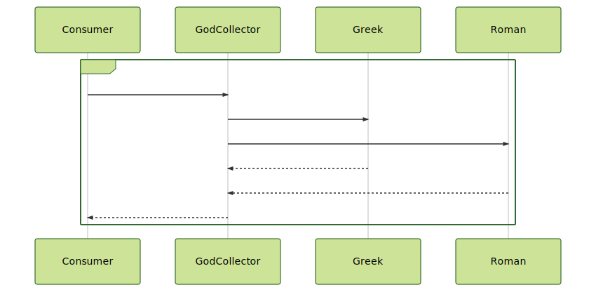

# Problem 9

```gherkin
Feature: Consume a REST God Collector

Background:
The new REST God collector service has a high demand
and it is necessary to protect the internal subsystems from
high levels of concurrent traffic.

Scenario: Consume the API in a Happy path case
    Given a REST API about God collector
    When  the client sends the request
    And   execute a Bulkhead Policy
    Then  return all gods

Scenario: Force a Bulkhead behaviour
    Given a REST API about God collector
    When  the client sends the request
    And   execute a Bulkhead Policy
    Then  return all gods
```




**Notes:**

- Try to test the solution without any Internet call
- Review the timeout for Every connection.
- Review the bulkhead options
- REST API 1: https://my-json-server.typicode.com/jabrena/latency-problems/greek
- REST API 2: https://my-json-server.typicode.com/jabrena/latency-problems/roman
