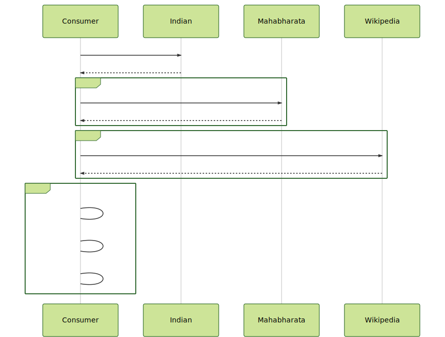

# Sequence diagram for Latency problem 9-1

- https://mermaidjs.github.io/mermaid-live-editor

## Diagram:

```
sequenceDiagram
    Consumer->>Indian: GET /indian
    Indian-->>Consumer: List of gods
    loop god
        Consumer->> Mahabharata: GET / godCounter{indianGod}
        Mahabharata-->>Consumer: God Counter List
    end
    loop god
        Consumer->> Wikipedia: GET / wiki/{indianGod}
        Wikipedia-->>Consumer: God Verified List
    end
    loop Stream    
        Consumer->Consumer: filter(God::verified)
        Consumer->Consumer: sort
        Consumer->Consumer: take(3)
    end
```

## Visualization:



## Config:

```
{
  "theme": "forest"
}
```
